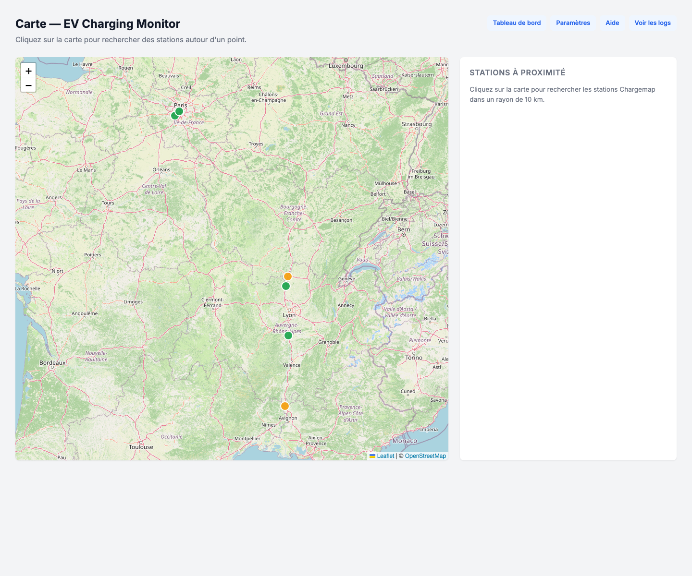
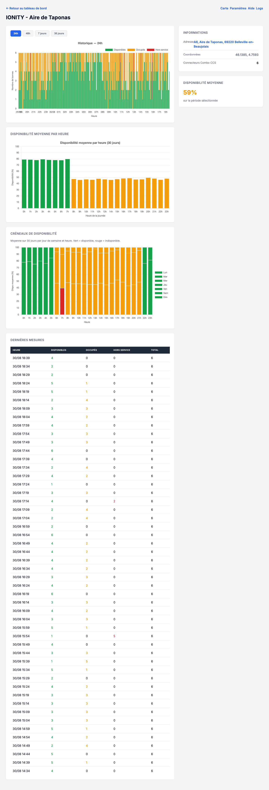
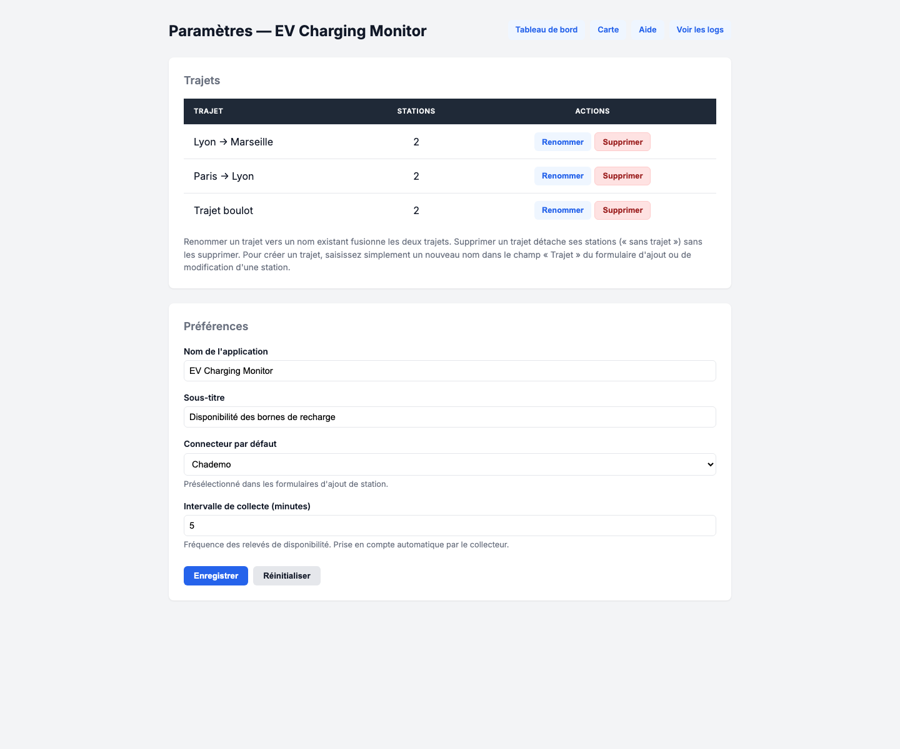

# EV Charging Monitor — Disponibilité des bornes de recharge


Application Python légère et **auto-hébergeable** qui surveille la **disponibilité de VOS bornes de recharge préférées**, partout en France : choisissez vos stations, organisez-les par trajet (ex. « Paris → Lyon ») et suivez le connecteur qui vous intéresse (Chademo, Combo CCS, Type 2…). Elle fournit des **statistiques de fiabilité** et une **heatmap des créneaux de disponibilité**.

Les données proviennent de l’API **Chargemap** et sont collectées toutes les 5 minutes (configurable). L’historique est stocké dans une base SQLite locale.

---

## 📸 Aperçu

### Tableau de bord


### Carte interactive et ajout de stations



### Fiabilité des stations sur 30 jours


### Détail d'une station : historique et créneaux de disponibilité




### Page Paramètres : trajets et préférences



---

## ✨ Fonctionnalités

- **Surveillance en temps réel** : disponibilité actuelle, nombre de bornes libres/occupées/hors service.
- **Historique détaillé** : graphiques 24h / 48h / 7 jours / 30 jours par station.
- **Statistiques de fiabilité** : taux de disponibilité moyen sur 7 et 30 jours, nombre d’indisponibilités, meilleur créneau horaire, score qualitatif.
- **Heatmap 7 × 24** : taux moyen de disponibilité par jour de semaine et par heure pour identifier les meilleurs créneaux de recharge.
- **Mini histogrammes 24h** directement dans le tableau de bord.
- **Gestion des stations** : ajout via recherche Chargemap (nom/ville) ou carte interactive, modification (nom, opérateur, adresse, trajet, connecteur, ordre d’affichage), suppression depuis le JSON.
- **Carte interactive** (`/carte`) : carte Leaflet/OpenStreetMap avec marqueurs colorés par disponibilité et recherche de stations autour d’un point cliqué.
- **Organisation par trajets** : chaque station peut être rattachée à un trajet libre (ex. « Paris → Lyon ») ; les trajets se renomment ou se suppriment depuis la page Paramètres.
- **Page Paramètres** (`/parametres`) : nom de l’application, sous-titre, connecteur surveillé par défaut et intervalle de collecte, modifiables sans toucher au `.env`.
- **Choix du connecteur surveillé** par station : Chademo (défaut), Combo CCS, Type 2…
- **Tri par trajet** (ordre alphabétique) et ordre d’affichage personnalisable au sein de chaque trajet.
- **Page d’aide** intégrée (`/aide`).
- **API JSON** pour consommer les données (stations, historique, stats, heatmap, logs).
- **Dashboard web** local : `http://127.0.0.1:5000`.

---

## 🚀 Démarrage rapide

### Prérequis

- Python 3.11+
- Aucune clé API n’est requise pour la collecte Chargemap (endpoints publics `mappy` et `pool-detail`).

### Installation locale

```bash
python3 -m venv .venv
source .venv/bin/activate
pip install -r requirements.txt
```

### Configuration

Créer un fichier `.env` à la racine (toutes les variables sont optionnelles) :

| Variable | Défaut | Description |
|----------|--------|-------------|
| `MONITOR_INTERVAL_MINUTES` | `5` | Fréquence de collecte en minutes |
| `DASHBOARD_HOST` | `127.0.0.1` | Interface d'écoute Flask |
| `DASHBOARD_PORT` | `5000` | Port d'écoute Flask |
| `DB_PATH` | `ev_monitoring.db` (racine) | Chemin vers la base SQLite |
| `STATIONS_FILE` | `<répertoire de DB_PATH>/stations_validated.json` | Chemin vers la liste des stations |
| `APP_NAME` | `EV Charging Monitor` | Nom affiché de l'application |
| `APP_SUBTITLE` | `Disponibilité des bornes de recharge` | Sous-titre affiché dans l'interface |
| `DEFAULT_CONNECTOR_TYPE` | `CHADEMO` | Connecteur surveillé par défaut |

`MONITOR_INTERVAL_MINUTES`, `APP_NAME`, `APP_SUBTITLE` et `DEFAULT_CONNECTOR_TYPE` ne sont que des **valeurs de repli** : elles peuvent être surchargées à chaud depuis la page **Paramètres** (`/parametres`), avec la priorité **valeur en base > variable d’env > défaut embarqué**.

> En production conteneurisée, utilisez `DASHBOARD_HOST=0.0.0.0` et montez un volume persistant pour `DB_PATH`.

### Lancer l’application

```bash
source .venv/bin/activate
python run.py
```

Puis ouvrir : [http://127.0.0.1:5000](http://127.0.0.1:5000)

---

## 🐳 Déploiement avec Docker

Une image Docker est publiée automatiquement sur GitHub Container Registry (GHCR) via GitHub Actions.

### Avec Docker Compose

```bash
mkdir -p data
docker compose pull
docker compose up -d
```

L’historique et la liste des stations sont persistés dans `./data/`.

### Avec Docker CLI

```bash
mkdir -p data
docker run -d \
  --name ev-charging-monitor \
  -e DASHBOARD_HOST=0.0.0.0 \
  -e DB_PATH=/app/data/ev_monitoring.db \
  -v $(pwd)/data:/app/data \
  -p 5000:5000 \
  --restart unless-stopped \
  ghcr.io/cabanach/ev-charging-monitor:latest
```

### Builder l’image localement

```bash
docker build -t ev-charging-monitor .
mkdir -p data
docker run -d \
  --name ev-charging-monitor \
  -e DASHBOARD_HOST=0.0.0.0 \
  -e DB_PATH=/app/data/ev_monitoring.db \
  -v $(pwd)/data:/app/data \
  -p 5000:5000 \
  --restart unless-stopped \
  ev-charging-monitor
```

### Mettre à jour sans perdre l’historique

```bash
docker compose pull
docker compose up -d
```

⚠️ **Ne jamais utiliser `docker compose down -v`** : cela supprimerait le volume et donc toute l’historique ainsi que la liste des stations.

Pour réinitialiser volontairement la base et la liste des stations :

```bash
docker compose down
rm data/ev_monitoring.db data/stations_validated.json
docker compose up -d
```

---

## 🛠️ Modifier la liste des stations

La source de vérité est `stations_validated.json` (ou `data/stations_validated.json` sous Docker). Sur une installation neuve, ce fichier est **vide** (`[]`) : vous démarrez sans station et ajoutez les vôtres depuis le dashboard (recherche par nom/ville ou carte interactive).

1. Éditer le fichier JSON.
2. Supprimer `ev_monitoring.db` (ou `data/ev_monitoring.db`) pour réinitialiser la base.
3. Relancer `python run.py` (ou redémarrer le conteneur).

Il est aussi possible d’ajouter ou de modifier une station directement depuis le dashboard via la recherche Chargemap ou la page Carte.

Le fichier `stations_example.json` contient un exemple de liste (5 stations de l’autoroute A8) à titre d’illustration ; il n’est **pas utilisé** par l’application.

---

## ⬆️ Mise à jour depuis la version « A8 »

Si vous utilisiez la version spécialisée « Chademo A8 », la mise à jour est **sans perte d’historique** : les tables `availability_log`, `collect_run` et `error_log` sont inchangées et la migration est purement additive (nouvelle table `settings` créée automatiquement au démarrage).

- **Docker (production)** : rien à faire. Le volume `data/` conserve votre liste de stations et votre base. Les anciens sens « Aix → Nice » / « Nice → Aix » deviennent des trajets, renommables depuis `/parametres`.
- **Dev local** : le nouveau `stations_validated.json` du dépôt est vide. Pour restaurer votre liste, copiez l’exemple puis redémarrez :

```bash
cp stations_example.json stations_validated.json
python run.py
```

---

## 🧪 Tests

Une suite de tests pytest est disponible dans le répertoire `tests/`.

```bash
source .venv/bin/activate
pip install -r requirements-dev.txt
pytest
```

Les tests couvrent :

- Le rendu HTML du dashboard et de la page de détail.
- Les réponses JSON des API (stations, historique, stats, heatmap).
- Les fonctions de statistiques et de heatmap SQLite.
- Les filtres Jinja2.

Ils utilisent une base temporaire et ne réalisent aucun appel réseau.

### Captures d’écran

Pour régénérer les captures du README avec des données factices :

```bash
source .venv/bin/activate
python scripts/capture_screenshots.py
```

Les images sont écrites dans `docs/screenshots/`.

---

## 📡 API

| Endpoint | Description |
|----------|-------------|
| `GET /api/stations` | Liste des stations avec dernière disponibilité |
| `GET /api/dashboard` | Dashboard complet (stations + dernière collecte) |
| `GET /api/history/<station_id>?hours=24` | Historique d’une station |
| `GET /api/hourly_stats/<station_id>?hours=720` | Disponibilité moyenne par heure de la journée |
| `GET /api/stats/<station_id>?hours=720` | Statistiques de fiabilité d’une station |
| `GET /api/stations/stats?hours=720` | Statistiques de fiabilité de toutes les stations |
| `GET /api/heatmap/<station_id>?days=30` | Heatmap 7 jours × 24 heures |
| `GET /api/logs?hours=24` | Logs d’erreurs récents |
| `POST /api/logs/clear` | Effacer les logs |
| `GET /api/stations/search?q=...` | Recherche de station Chargemap (nom/ville) |
| `GET /api/stations/nearby?lat=&lon=&radius=` | Stations Chargemap autour d’un point (rayon en km) |
| `POST /api/stations/add` | Ajouter une station |
| `POST /api/stations/<id>/edit` | Modifier une station |
| `POST /api/settings` | Enregistrer les préférences (nom, sous-titre, connecteur, intervalle) |
| `POST /api/settings/reset` | Réinitialiser les préférences |
| `POST /api/trajets/rename` | Renommer un trajet (fusion possible) |
| `POST /api/trajets/delete` | Supprimer un trajet (stations détachées, non supprimées) |

---

## 📊 Consommation API

À titre d’exemple, avec **5 stations** et un cycle toutes les **5 minutes** :

- 5 appels / cycle à l’API Chargemap (`pool-detail/v2/pools/<slug>`)
- 60 appels / heure
- ~1 440 appels / jour

Restez raisonnable sur la fréquence pour éviter d’être limité par les endpoints anonymes de Chargemap.

---

## 📁 Structure

```
.
├── .env                            # variables d’environnement optionnelles
├── .env.example                    # modèle de configuration
├── requirements.txt                # dépendances Python
├── requirements-dev.txt            # dépendances de développement
├── run.py                          # point d’entrée principal
├── stations_validated.json         # stations surveillées (vide par défaut, source de vérité)
├── stations_example.json           # exemple de liste (stations A8), non utilisé par l'app
├── ev_monitoring.db                # base SQLite générée automatiquement
├── compose.yaml                    # stack Docker Compose de production
├── Dockerfile                      # image de production
├── .dockerignore
├── README.md
├── AGENTS.md
├── design-backlog.md
├── docs/screenshots/               # captures d’écran du README
├── scripts/
│   └── capture_screenshots.py      # génération des captures Playwright
├── tests/                          # tests pytest
└── ev_monitor/                     # package Python principal
    ├── __init__.py
    ├── config.py                   # chargement de la configuration/env
    ├── chargemap_client.py         # client API Chargemap (recherche + disponibilité)
    ├── storage.py                  # accès SQLite (stations + logs)
    ├── monitor.py                  # scheduler de collecte périodique
    ├── dashboard.py                # application Flask + routes + templates filters
    └── templates/
        ├── index.html              # tableau de bord principal
        ├── station.html            # page de détail d'une station
        ├── logs.html               # page des logs
        ├── carte.html              # carte interactive (Leaflet/OSM)
        ├── parametres.html         # page des paramètres (trajets + préférences)
        └── aide.html               # page d'aide utilisateur
```

---

## 📄 Licence

Projet personnel. Utilisation et modification libres dans un cadre privé.
