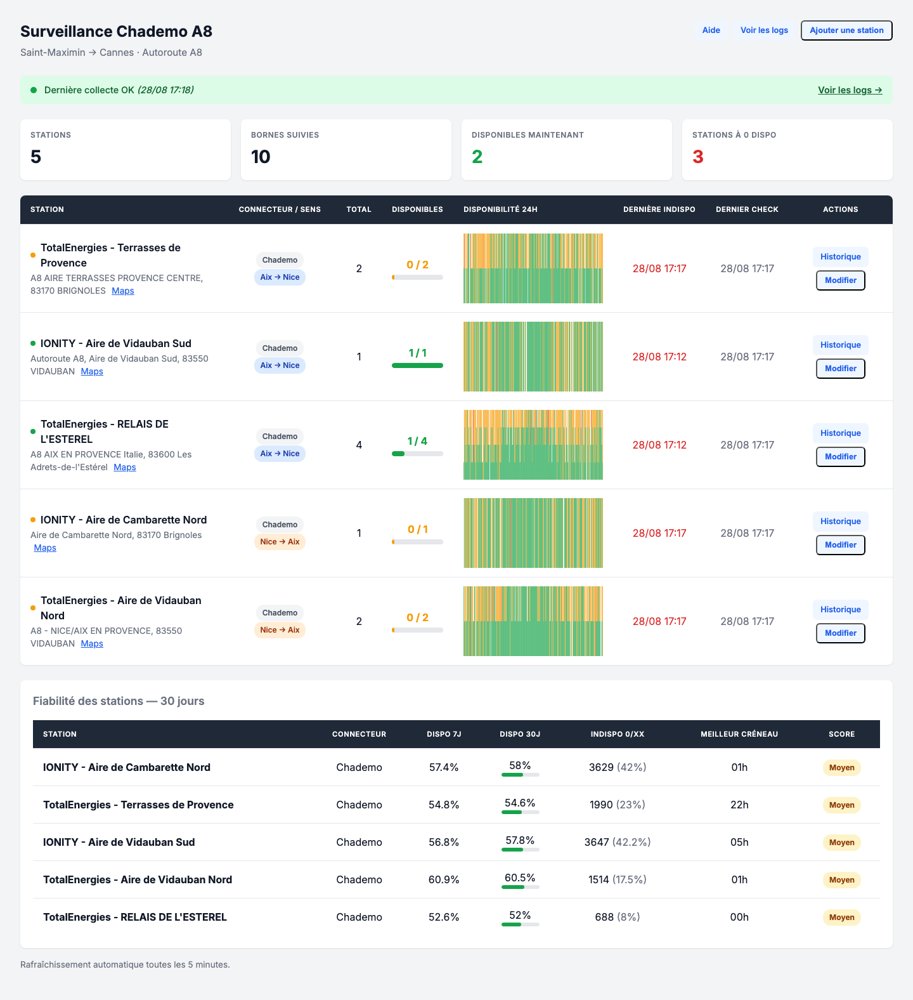
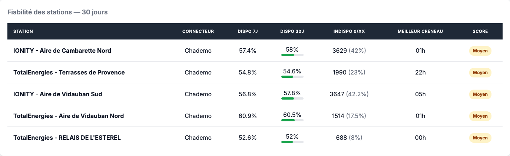
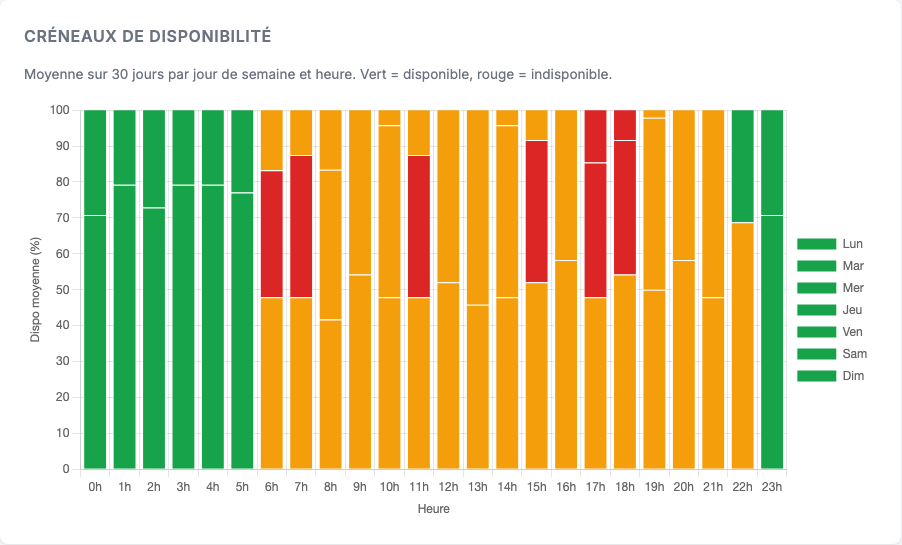

# EV Charging Monitor — Fiabilité des bornes Chademo A8


Application Python légère qui surveille la **disponibilité des bornes de recharge Chademo** sur l’autoroute **A8** (tronçon Saint-Maximin → Cannes) et fournit des **statistiques de fiabilité** et une **heatmap des créneaux de disponibilité**.

Les données proviennent de l’API **Chargemap** et sont collectées toutes les 5 minutes (configurable). L’historique est stocké dans une base SQLite locale.

---

## 📸 Aperçu

### Tableau de bord



### Fiabilité des stations sur 30 jours



### Créneaux de disponibilité par jour / heure



---

## ✨ Fonctionnalités

- **Surveillance en temps réel** : disponibilité actuelle, nombre de bornes libres/occupées/hors service.
- **Historique détaillé** : graphiques 24h / 48h / 7 jours / 30 jours par station.
- **Statistiques de fiabilité** : taux de disponibilité moyen sur 7 et 30 jours, nombre d’indisponibilités, meilleur créneau horaire, score qualitatif.
- **Heatmap 7 × 24** : taux moyen de disponibilité par jour de semaine et par heure pour identifier les meilleurs créneaux de recharge.
- **Mini histogrammes 24h** directement dans le tableau de bord.
- **Gestion des stations** : ajout via recherche Chargemap, modification (nom, opérateur, adresse, sens, connecteur, ordre d’affichage), suppression depuis le JSON.
- **Choix du connecteur surveillé** par station : Chademo (défaut), Combo CCS, Type 2…
- **Tri par sens de circulation** (Aix → Nice / Nice → Aix) et ordre d’affichage personnalisable.
- **Page d’aide** intégrée (`/aide`).
- **API JSON** pour consommer les données (stations, historique, stats, heatmap, logs).
- **Dashboard web** local : `http://127.0.0.1:5000`.

---

## 🚀 Démarrage rapide

### Prérequis

- Python 3.11+
- Aucune clé API n’est requise pour la collecte Chargemap (endpoints publics `mappy` et `pool-detail`).

### Installation locale

```bash
python3 -m venv .venv
source .venv/bin/activate
pip install -r requirements.txt
```

### Configuration

Créer un fichier `.env` à la racine (toutes les variables sont optionnelles) :

```env
MONITOR_INTERVAL_MINUTES=5
DASHBOARD_HOST=127.0.0.1
DASHBOARD_PORT=5000
```

> En production conteneurisée, utilisez `DASHBOARD_HOST=0.0.0.0` et montez un volume persistant pour `DB_PATH`.

### Lancer l’application

```bash
source .venv/bin/activate
python run.py
```

Puis ouvrir : [http://127.0.0.1:5000](http://127.0.0.1:5000)

---

## 🐳 Déploiement avec Docker

Une image Docker est publiée automatiquement sur GitHub Container Registry (GHCR) via GitHub Actions.

### Avec Docker Compose

```bash
mkdir -p data
docker compose pull
docker compose up -d
```

L’historique et la liste des stations sont persistés dans `./data/`.

### Avec Docker CLI

```bash
mkdir -p data
docker run -d \
  --name ev-charging-monitor \
  -e DASHBOARD_HOST=0.0.0.0 \
  -e DB_PATH=/app/data/ev_monitoring.db \
  -v $(pwd)/data:/app/data \
  -p 5000:5000 \
  --restart unless-stopped \
  ghcr.io/cabanach/ev-charging-monitor:latest
```

### Builder l’image localement

```bash
docker build -t ev-charging-monitor .
mkdir -p data
docker run -d \
  --name ev-charging-monitor \
  -e DASHBOARD_HOST=0.0.0.0 \
  -e DB_PATH=/app/data/ev_monitoring.db \
  -v $(pwd)/data:/app/data \
  -p 5000:5000 \
  --restart unless-stopped \
  ev-charging-monitor
```

### Mettre à jour sans perdre l’historique

```bash
docker compose pull
docker compose up -d
```

⚠️ **Ne jamais utiliser `docker compose down -v`** : cela supprimerait le volume et donc toute l’historique ainsi que la liste des stations.

Pour réinitialiser volontairement la base et la liste des stations :

```bash
docker compose down
rm data/ev_monitoring.db data/stations_validated.json
docker compose up -d
```

---

## 🛠️ Modifier la liste des stations

La source de vérité est `stations_validated.json` (ou `data/stations_validated.json` sous Docker).

1. Éditer le fichier JSON.
2. Supprimer `ev_monitoring.db` (ou `data/ev_monitoring.db`) pour réinitialiser la base.
3. Relancer `python run.py` (ou redémarrer le conteneur).

Il est aussi possible d’ajouter ou de modifier une station directement depuis le dashboard via la recherche Chargemap.

---

## 🧪 Tests

Une suite de tests pytest est disponible dans le répertoire `tests/`.

```bash
source .venv/bin/activate
pip install -r requirements-dev.txt
pytest
```

Les tests couvrent :

- Le rendu HTML du dashboard et de la page de détail.
- Les réponses JSON des API (stations, historique, stats, heatmap).
- Les fonctions de statistiques et de heatmap SQLite.
- Les filtres Jinja2.

Ils utilisent une base temporaire et ne réalisent aucun appel réseau.

### Captures d’écran

Pour régénérer les captures du README avec des données factices :

```bash
source .venv/bin/activate
python scripts/capture_screenshots.py
```

Les images sont écrites dans `docs/screenshots/`.

---

## 📡 API

| Endpoint | Description |
|----------|-------------|
| `GET /api/stations` | Liste des stations avec dernière disponibilité |
| `GET /api/dashboard` | Dashboard complet (stations + dernière collecte) |
| `GET /api/history/<station_id>?hours=24` | Historique d’une station |
| `GET /api/hourly_stats/<station_id>?hours=720` | Disponibilité moyenne par heure de la journée |
| `GET /api/stats/<station_id>?hours=720` | Statistiques de fiabilité d’une station |
| `GET /api/stations/stats?hours=720` | Statistiques de fiabilité de toutes les stations |
| `GET /api/heatmap/<station_id>?days=30` | Heatmap 7 jours × 24 heures |
| `GET /api/logs?hours=24` | Logs d’erreurs récents |
| `POST /api/logs/clear` | Effacer les logs |
| `GET /api/stations/search?q=...` | Recherche de station Chargemap |
| `POST /api/stations/add` | Ajouter une station |
| `POST /api/stations/<id>/edit` | Modifier une station |

---

## 📊 Consommation API

Avec **5 stations** et un cycle toutes les **5 minutes** :

- 5 appels / cycle à l’API Chargemap (`pool-detail/v2/pools/<slug>`)
- 60 appels / heure
- ~1 440 appels / jour

Restez raisonnable sur la fréquence pour éviter d’être limité par les endpoints anonymes de Chargemap.

---

## 📁 Structure

```
.
├── .env                            # variables d’environnement optionnelles
├── .env.example                    # modèle de configuration
├── requirements.txt                # dépendances Python
├── requirements-dev.txt            # dépendances de développement
├── run.py                          # point d’entrée principal
├── stations_validated.json         # stations surveillées (source de vérité)
├── ev_monitoring.db                # base SQLite générée automatiquement
├── compose.yaml                    # stack Docker Compose de production
├── Dockerfile                      # image de production
├── .dockerignore
├── README.md
├── AGENTS.md
├── design-backlog.md
├── docs/screenshots/               # captures d’écran du README
├── scripts/
│   └── capture_screenshots.py      # génération des captures Playwright
├── tests/                          # tests pytest
└── ev_monitor/                     # package Python principal
    ├── __init__.py
    ├── config.py                   # chargement de la configuration/env
    ├── chargemap_client.py         # client API Chargemap (recherche + disponibilité)
    ├── storage.py                  # accès SQLite (stations + logs)
    ├── monitor.py                  # scheduler de collecte périodique
    ├── dashboard.py                # application Flask + routes + templates filters
    └── templates/
        ├── index.html              # tableau de bord principal
        ├── station.html            # page de détail d'une station
        ├── logs.html               # page des logs
        └── aide.html               # page d'aide utilisateur
```

---

## 📄 Licence

Projet personnel. Utilisation et modification libres dans un cadre privé.
